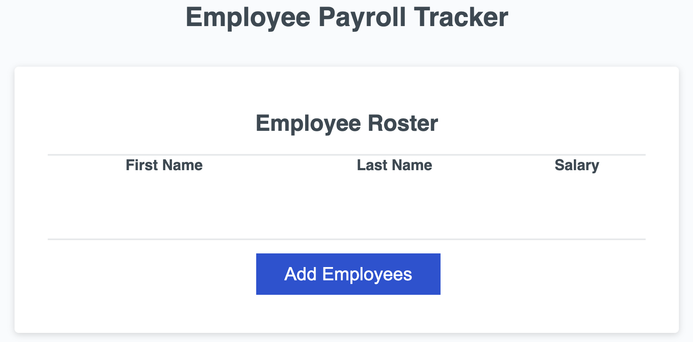
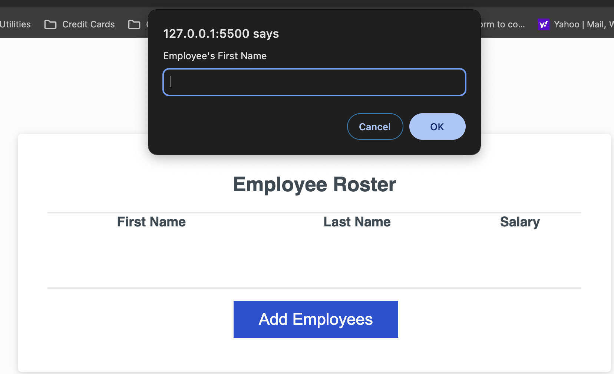
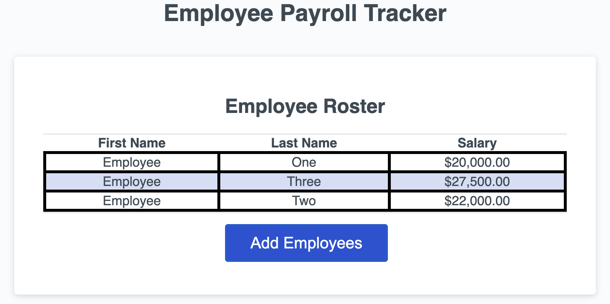

# <Your-Project-Title>

## Description

This application allows the user to enter in employee data. The user can enter a first name, last name, and salary for as many employees they want.

## Usage

Click the 'Add Employee' button to add a new employee.

First enter the employee's first name. Then enter their last name. Finally enter their salary.

Once complete, you will be prompted to add another or cancel. When you choose cancel, a list of employees will be displayed on the screen.

## License

This app uses a MIT Licence

---